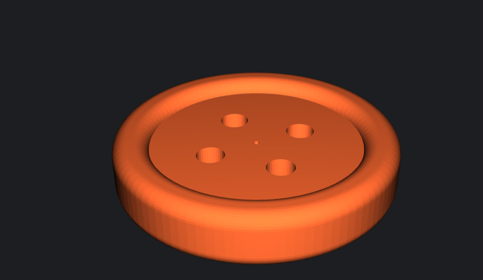
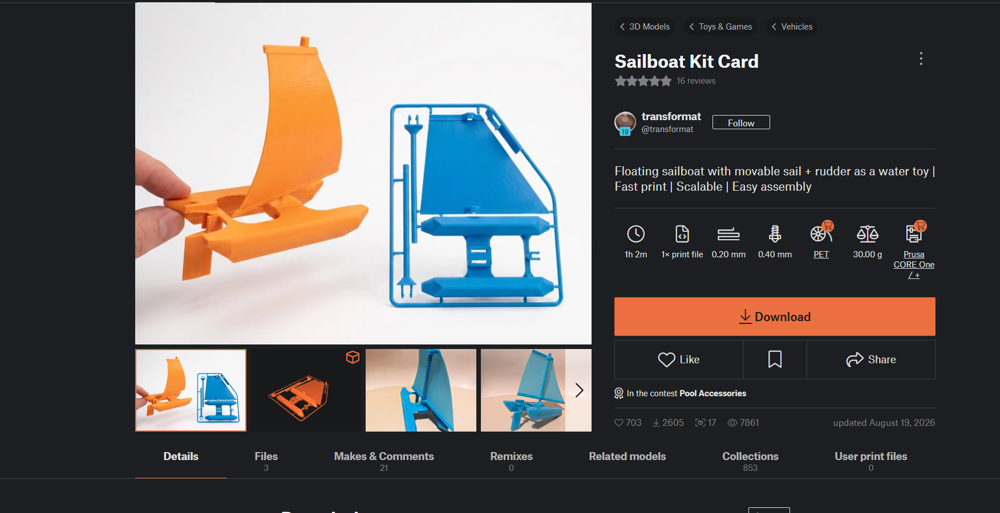

# A2 – Print Something Small 

From class 08/25/26: Dfam: An important guideline/design rule for Additive Manufacturing is a minimum wall thickness and feature size. This minimum varies depending on the type of printing being done. If components are too small, they can warp and deform under the higher temperatures during printing.
(https://www.wevolver.com/article/design-for-additive-manufacturing-a-dfam-guide-for-engineers)   

FDM: Layer Adhesion is the bond between each layer of material stack one on top of another, which can sometimes fail. Designers can work around this by slightly increasing temperatures of the nozzle, which will allow the layers to be bonded easier for longer.   

Small group: My group mates were discussing how layer adhesion issues can be solved by reorienting the model, likely through 3D instead of 2d layers.  

# Documentation 08/27/26:  

## Download: ##  

I chose to print a small button, I thought this was a great trial for my first print. It was small, flat, and I could possibly use it.  
  

I also thought about printing this boat that you pull out of the frame and put together, or another design that worked similarly. However, I thought it may be too complicated or take two long, an I didn't want to hold my group up.  

