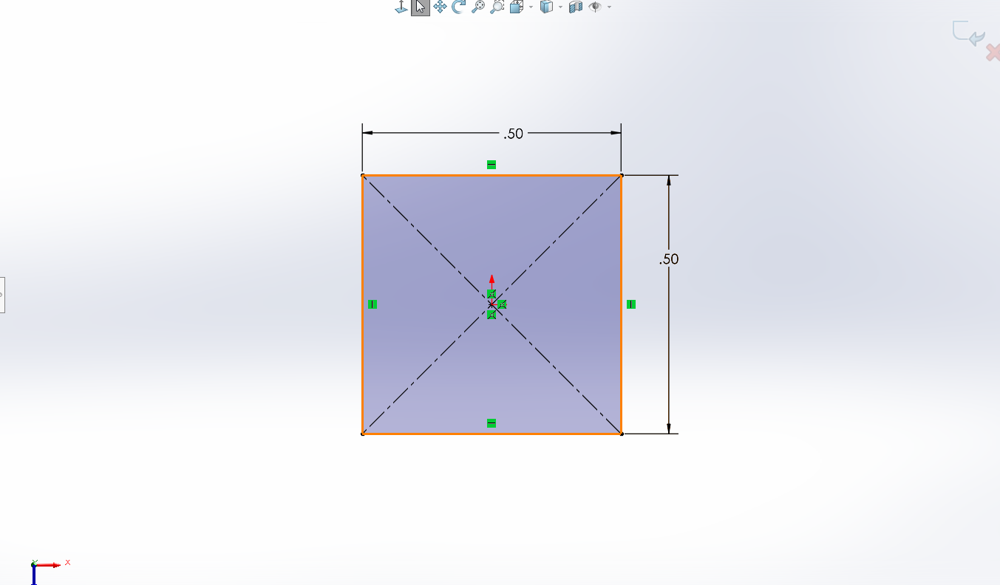
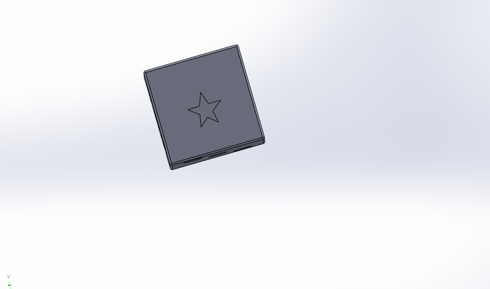
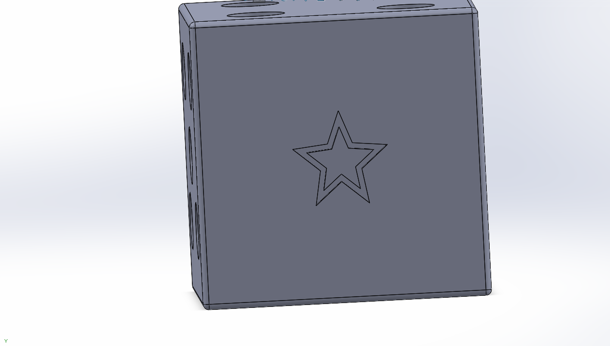
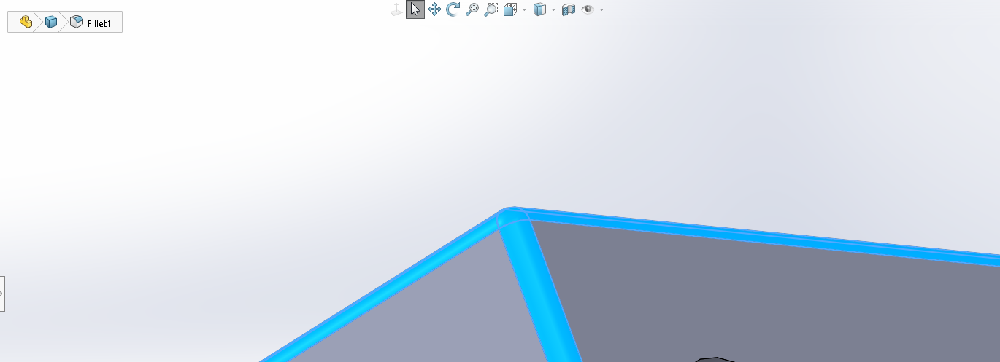
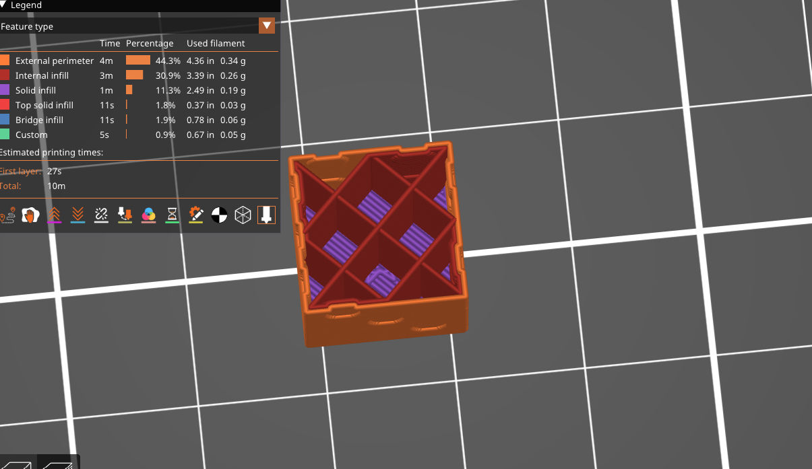
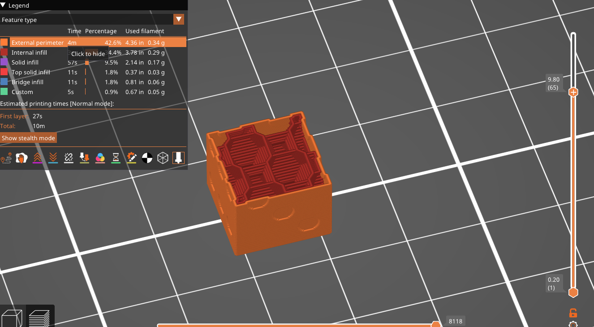
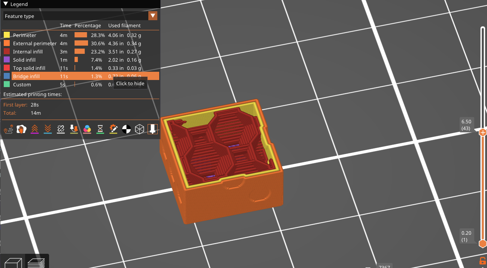
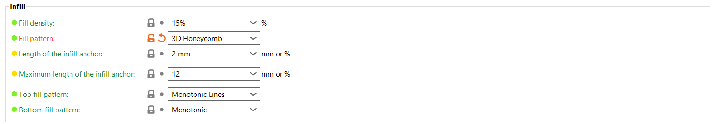
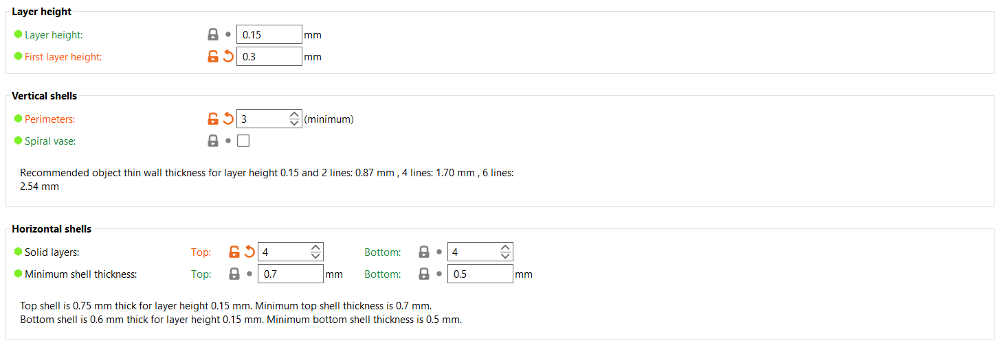

# A3 – Design Something Small  

## Design  

I chose to design a die, I chose this because it made sense for the dimension constraints and allowed me to test how the printer handled small indentation. I made it a cube with a dimension of 0.50 in, because of the max height constraint.  
  insert  

For the side of the one side of the die, I chose to make it a star instead of a dot just to add some complexity to the print.  
  

I decided to make the indent an outline, this is because I wanted to make the one side be the surface on the print plate. I thought giving more surface area would help the print and reduce overhang.  
  

I also added fillets to all the edges, this was mostly a personal design choice, but I was interested to see how the printer would handle these curved edges.  
  

## Research  

**Lightning infill:**  
The lightning infill is used when time and cost is of most concern. This infill only adds supports at the top and bottom of the print, stretching out at somewhat random depending on the structure, into the center, but does not at all fill the center. This is often used for quick prototyping or for models that are not meant to be interacted with, it is also the cheapest and quickest infill to use because it uses less material. This infill provides little to no structural integrity.  

**Line infill:**  
The line infill is also ideal for cost and time efficiency, and provides more structure than lightning. Line infill also provides more flexibility of a print compared to more dense infills. It is similar to grid pattern, but because of the order of which the lines are printed, it has less chance of being stringy, and lowers the risk of print failure.  

**Concentric Infill:**  
The concentric infill has similar function to the line infill, as it provides good flexibility. It is also ideal for aesthetics in transparent prints, because the infill lines are parallel to the perimeters.  

Infill density is important, as it completely impact the structural strength, the more material in the print and the denser it is, a larger load can be applied to it. Different infill patterns serve different mechanical purposes, for example, gyroid infill provides the same support on each perimeter, whereas an infill like cubic provides more support on the top and bottom then the sides.  

## Preprocessor and printing  

I loaded my print into Prusaslicer and immediately oriented it so the star pattern was on the surface, this allowed the most surface area to be printed on to reduce the risk of any error.  
I did not need to scale, as I had dimensioned in SolidWorks to fit the necessary constraints.  

There were multiple infill choices that I was deciding between. Specifically between line and the 3D honeycomb infills. I also was deciding how many perimeter walls to use.  
    

Due to the fact that a die would be thrown around and subject to a lot of repeated impact, I decided to go with 3D honeycomb. This was because this infill supports all the perimeters of the cube. The choice of 15% was just a balance between time efficiency while still providing adequate strength.  
  

For the wall thickness, I upped the perimeters walls from the default of 2 to 3. This was to provide extra strength and durability. My print was small enough so that this did not impact print time much. I reduced the top thickness to match the bottom because I didn't want the die to be off weighted, even though it would be basically unnoticeable.  
  

I realized later that I may needed to have added extra bottom layers, reasoning will be detailed below.  

## Print  

