# A4 – Benchmark a Parameter  

## Objective

Design an artifact that benchmarks a parameter for the Prusa Core One.  

**Parameter chosen:** Overhang angle test.  
I am using PETG, which according to research from (https://www.3dmag.com/3d-wikipedia/3d-printing-overhang-support-angles-materials/) PETG can handle an overhang angle of about 45-50 degrees, so I think it should begin to fail around there.  

## Design/Preprocessor  

For my design I chose to create a shape that would provide a space for 8 different overhangs to test different angles with the goal to see how clean they printed without supports. 
I chose to design the angles of my overhangs to range from 30 degrees to 65 degrees, increasing in 5 degree increments. I wanted to see the difference in print quality from an angle that should print cleaning to one that would very likely print messily or sag. Originally I had the angles ranging much lower and with smaller increments and a max angle of 54 degrees, but I realized that this would would likely not be enough of an angle to properly test the capabilities of the printer.    

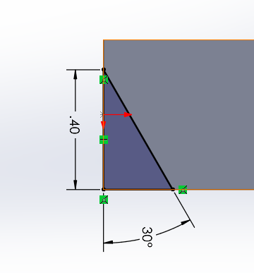 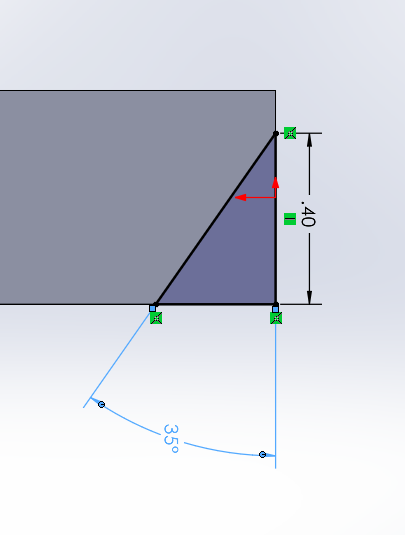 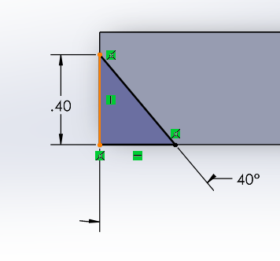 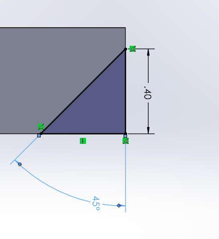 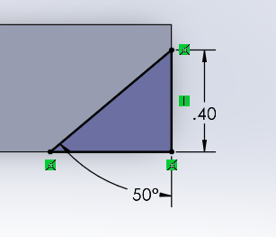 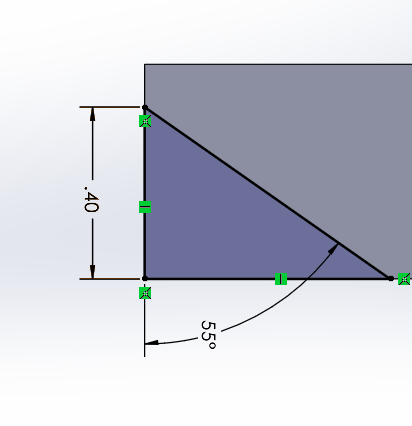 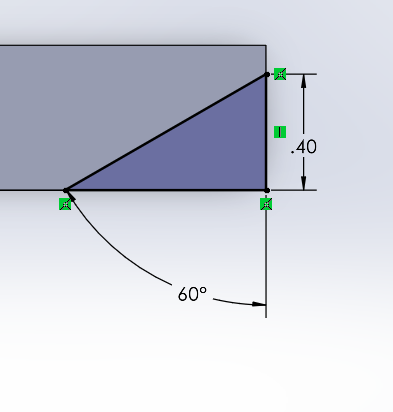 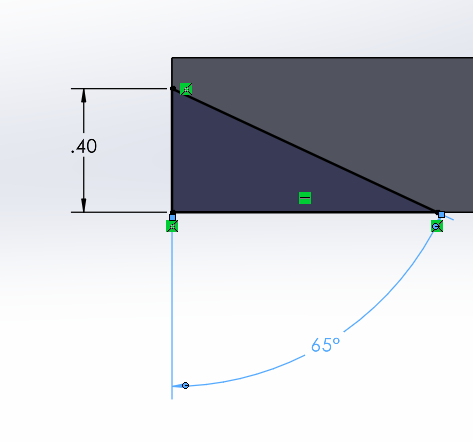  

The general shape is a sort of cross. This was pretty arbitrary, I just chose a shape that had enough outcrops to have 8 overhangs, I cut a hole in the center to cut back on time and material.  

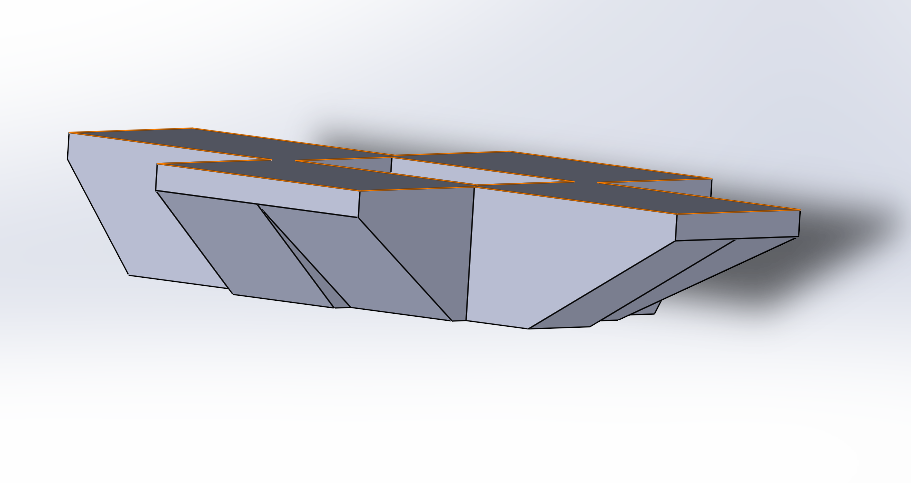  

**CAD file:** https://drive.google.com/file/d/1zFkyJvGv0AxyjE8gTpEmNKdAtRsBt-d7/view?usp=sharing  

For the lengths of the overhang, I wanted them to be tall and deep enough so that any errors in the overhang would be visible and clear.  

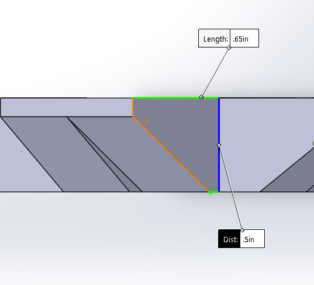  

In PrusaSlicer, I turned supports off, changed the infill to gyroid and to 10% density, and decreased the layer height from 0.15mm to 0.10mm. It was not necessary to scale as I had intentioned my dimensions in SolidWorks. I didn't need to change the build orientation from my design, it is meant to have the angles have open space underneath them for testing, so the side facing down was the one with all the overhangs.   

I turned supports off so that the overhangs would be forced to support themselves at different angles, which is the point of this test.  
Also, I wanted to specifically test the capabilities of the angles of PETG filament, which I read is not as good at overhangs as PLA. With the PETG's capabilities tested as being okay without supports at or below 50 degrees. Additionally, not considering material the **FDM Design Rules for 3D printing** labels the max overhang as 45 degrees.  

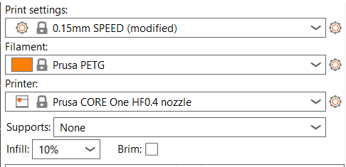  

I decided to attempt to try to change a build parameter that may help the overhang print properly beyond the 45-50 degree limit that is usually prescribed.  

I researched some ways in which this would be possible and these were the most common ways to improve overhang printing.  
-  Lower print speeds at perimeters and overhangs to allow layers to cool  
-  Increase minimum layer time to allow nozzle to pause and allow layer to cool  
-  Increase number of perimeters
-  Thinner layers, so there is less material to sag per layer and cause error
  Source: https://3dx.info/mastering-overhangs-design-strategies-for-support-free-3d-printing/

I decided to try out the thinner layer option. So I decreased it from the default 0.15mm to 0.10mm.   

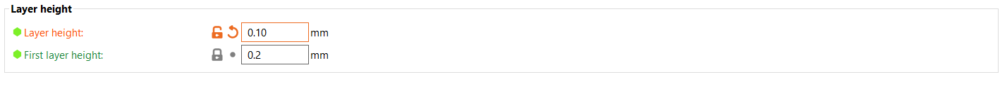  

Also, I wanted to choose an infill that had decent coverage on the outer perimeters to support the overhangs, I chose gyroid, as it appeared to cover the overhang walls decently, but I kept the density at 10% as I didn't want to overcompensate for the overhangs.  

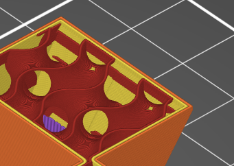  

The final print time was 31 minutes, this longer time was mainly due to the decrease in layer height, shorter layers = more layers = more time.  

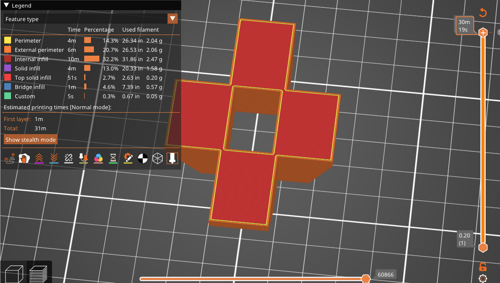  

## Print  
My PETG print tested 8 overhangs ranging from 30 to 65 degrees.  
It appears all of the angles came out very clean and smooth except the 65 degree angle which appears to have a small amount of sagging.  
Print Video: https://drive.google.com/file/d/1Rn4DzQQuVR_SVua_di2C4EQRPu075xq3/view?usp=sharing  

Angles 50 (right) and 55 (left) degrees.  
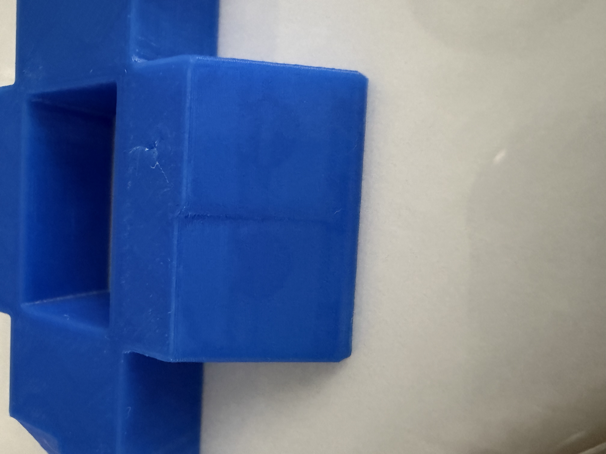  

Angles 60 (right) and 65 (left) degrees.  
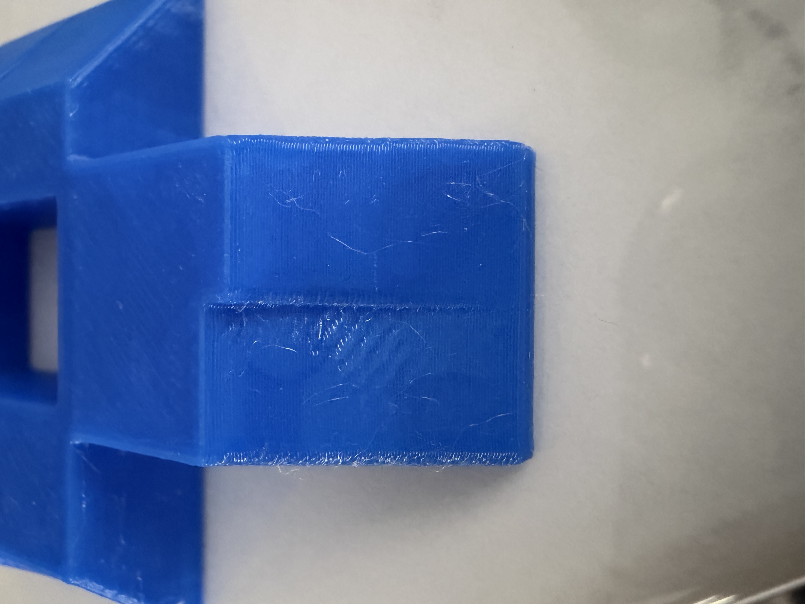  

## Lessons Learned  

The outcome was different than what I originally thought, the angles greater than 45 degrees of which there were four 50-65 degrees all came out much better than I thought they would. The only angle that came out with error was 65 degrees.   

So comparing to the FDM row of the design rule chart that states the max angle that a wall can be printed without supports my print exceeded those specs. This is likely because of the decrease in layer height chosen, which didn't allow much sagging and was more precise. It was my intention to see how the layer height helped the quality of the overhangs and it performed better than I thought. I also think the way I combined the overhangs in pairs of two impacted their quality by giving the overhangs support from the side.  

Ideally my print would have shown more faults in the printing process when trying to achieve overhangs. Although this displayed that lowering the layer height can improve the quality of overhangs. If I were to repeat this test, I would have done a few things differently. First being to test angles larger than 65 degrees with the same layer height to truly test its capabilities. It would've also been informative to test the same print with PLA to see which filament was more successful. If I were to model this same design or something similar again I would have made the overhangs taller, wider, and completely isolated, this would give a better benchmark that would be more applicable to future designs. Finally, if I could go back I might've simply left the layer height at its default of 0.15mm. The 0.10mm increased the print time considerably, and for future prints that may be larger this may be impractical, so testing the default layer height may have been more useful.  

**Time Taken**  
Approximately 3-4 hours, the print took about an hour as I had some issues with the printer. I also went back to change the overhang angles multiple times after considering my desired outcome more.  

**Resources:**  
-https://www.3dmag.com/3d-wikipedia/3d-printing-overhang-support-angles-materials/  
-https://3dx.info/mastering-overhangs-design-strategies-for-support-free-3d-printing/  
-Design Rules for 3D Printing PDF  
-https://wiki.bambulab.com/en/filament-acc/filament/print-quality/overhang  

