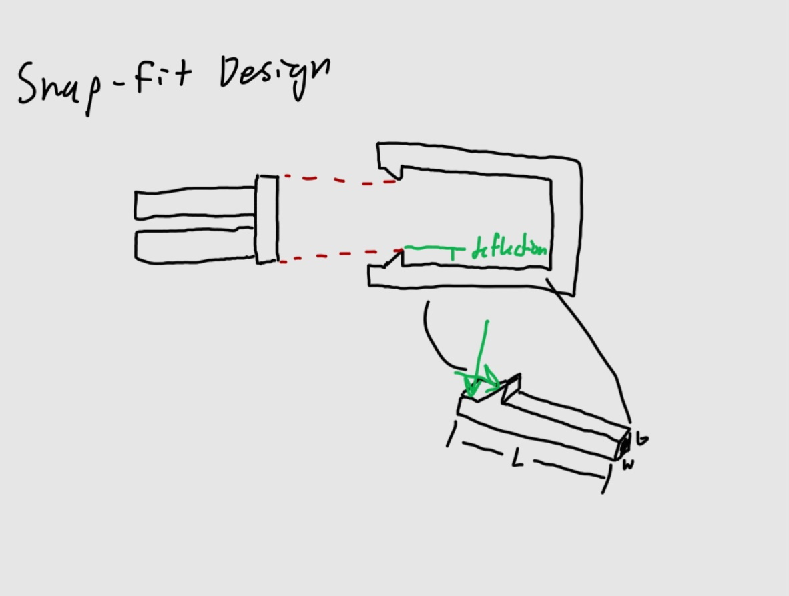

# A5 – Design A Snap Fit

## Objective  
Parametrically design an assembly of two constituents that snap together by treating the parts as cantilever beams and solving for the geometry using the beam bending equations.

## Analyze  

The design I came up with is a U-shaped bracket with two right triangle extrusions that act as clips for a coin-shaped cylinder to snap into. The cylinder is attached at the bottom to a longer cylinder shell with two cuts down the length so that a squeezing action can be performed on the cylinder.  

Before I could model my parts parametrically in SolidWorks I did a combination of choosing dimensions and solving for the related dimensions to accommodate for loads and dimensions. I began by analyzing an axial load that would be applied to the clips when the 

## Decide

## Communicate

