# A5 – Design A Snap Fit

## Objective  
Parametrically design an assembly of two constituents that snap together by treating the parts as cantilever beams and solving for the geometry using the beam bending equations.

## Design  

The design I came up with is a U-shaped bracket with two right triangle extrusions that act as clips for a coin-shaped cylinder to snap into. The cylinder is attached at the bottom to a longer cylinder shell with two cuts down the length so that a squeezing action can be performed on the cylinder.  

Before I could model my parts parametrically in SolidWorks I did a combination of choosing dimensions and solving for the related dimensions to accommodate for loads and dimensions. I began by analyzing an axial load that would be applied to the individual clips when the cylinder would be pushed against it  using an allowable stress found from the yield strength and a safety factor. These calculations would give me a minimum area the back of the clip would need to prevent fracture. I figured this would be a good place to start because I would use the height of this clip as the deflection the connected beam would need to undergo, which I will use in later calculations. I used an estimated 8 lbf for this axial load.     

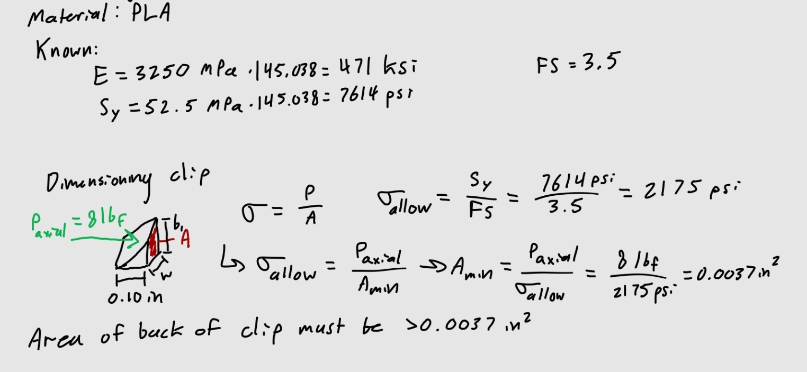  

Now that I have an minimum area, I can decide a base/height and width, and check to ensure they met the minimum requirement.  

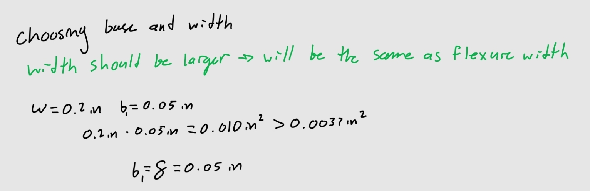  

Next I needed to solve for the length of the to arms of the bracket, I had already decided the width in the last part, and just needed the base of the arm, which I labeled b2. I decided to make b2 the same as the width so it would be a square cross section, both for ease of calculation and appearance, I didn't want to make it less than the width, and cause the length to be too long, as it wasn't needed for my design. I used beam bending formulas for a cantilever beam with a concentrated load at the free end. First I used the one with consideration of a flexing deformation, which would be the height of the clip I solved for. Then I used the beam bending equation in consideration of maximum stress, or in this case the allowable stress in relation to the safety factor.  

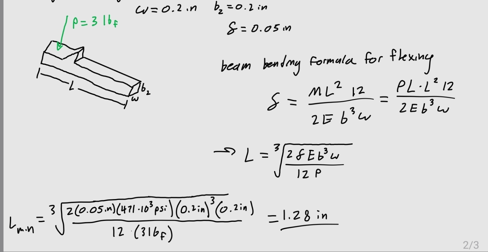  
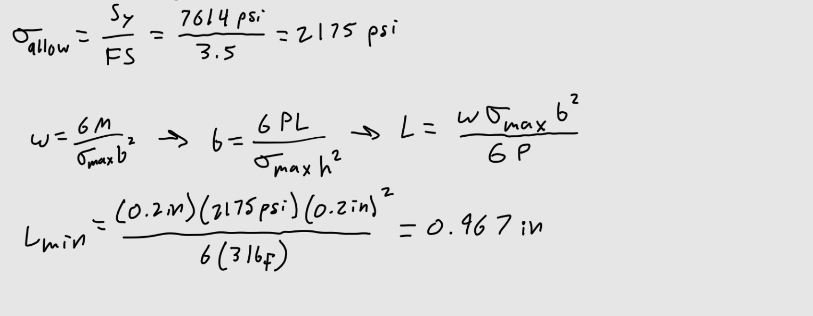  

The larger of the two lengths would be what I needed to use, which was 1.28 inches.  

I then checked for shear stress in the clip, and compared it to the allowable shear stress, using the safety factor and shear strength of PLA.  

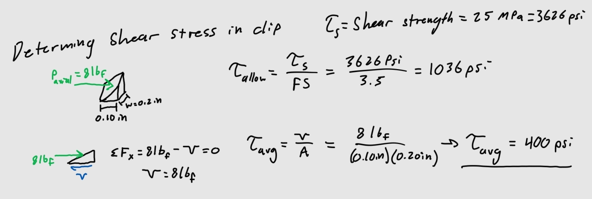  

Finally I created dimensions for the parts of the bracket and cylinder that did not carry loads that needed to be considered or calculated. The connection between the arms I chose as 1.0in so that it would be relatively proportional to the arms, and its thickness I dimensioned to be less than the arms so that it would have less impact on the flexure of the arms. For the cylindrical piece, I made the top cylinders diameter 0.005 inch less than the width of the gap between the arms(0.6 in). I did this to account for accuracy tolerance limitations of the Prusa, from research I found this tolerance to be about 0.004 inches. The 0.005 inch difference would ensure that the cylinder wouldn't print to a diameter larger than the gap.  

The lip between the top cylinder and bottom hollow cylinder on each side was 0.0725 inch wide, this lip is where the clip and fitted cylinder meet. So I made the lip slightly larger than the height of the clip with the idea that it would fit here and not collide with the lower cylinder, and give it the ability to rotate easily. In hindsight I would've made the lip the same as the height of the clip (0.05 in) so that the clip fit snuggly onto the cylinder part. Although Prusa's accuracy tolerances may have made this a bit difficult.  

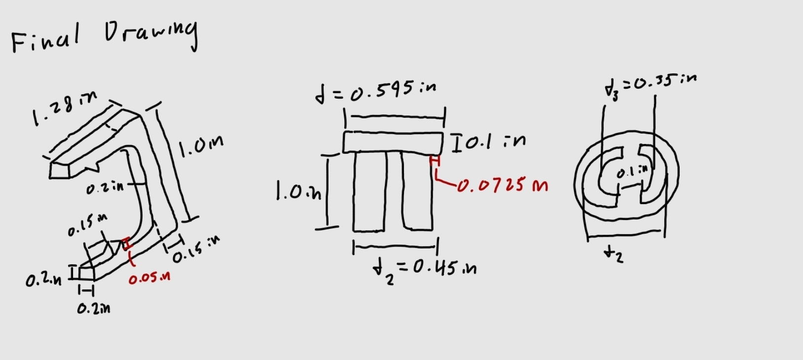  

**Parametric Design:**  

I applied all the parameters that I chose or solved for in the first part of my process into the equations sheet in SolidWorks. I used the beam bending equation for flexing deformation for my length. I chose this parameter because in my calculations I found that beam bending equation to yield a larger minimum length over the one that considered the allowable stress.  

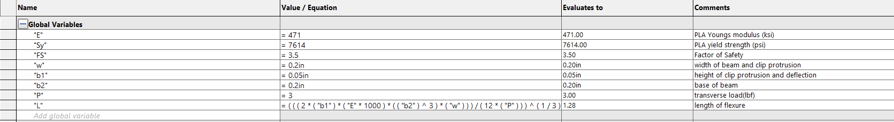  

The parameters for the base and width of the arms was changed. I reduced the base and width from 0.3in to 0.2in. I didn't want to overcompensate for the axial load and make it more difficult to flex the part. This became apparent to me when I modeled the part and the arms appeared chunky, especially in relation to the clip. So I went back to my drawing and changed the values, and changed the model.   

Designing the bracket:  

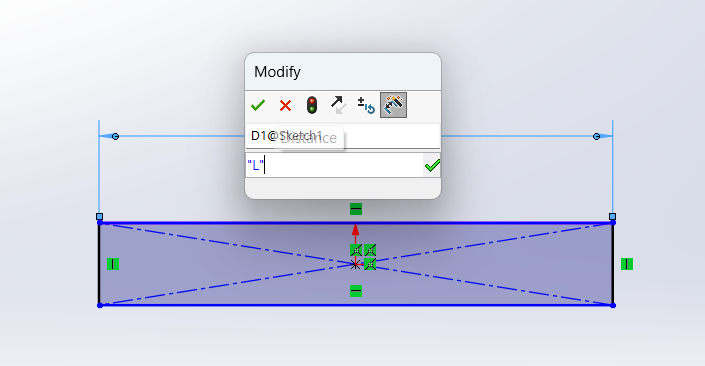 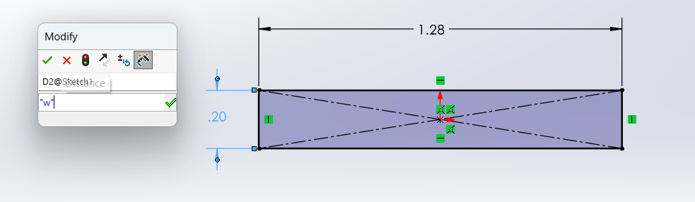 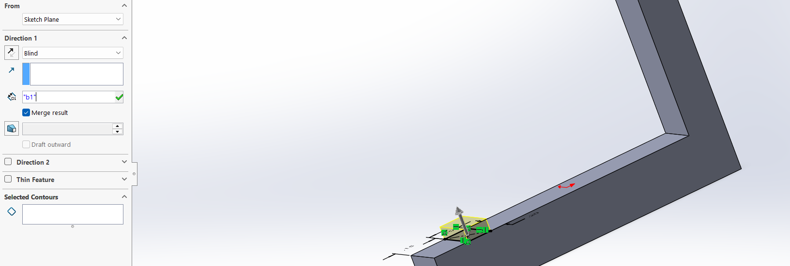  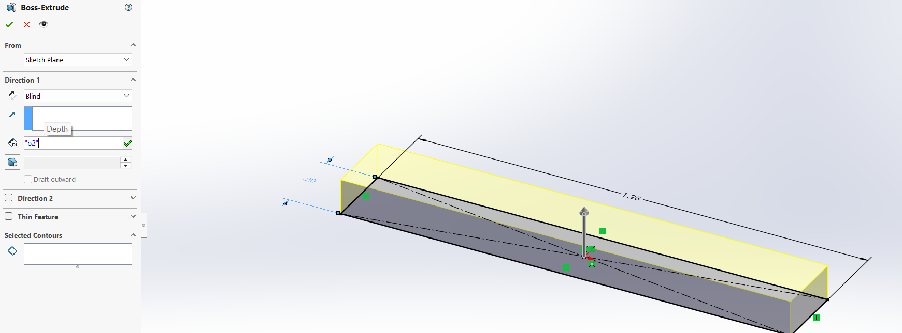 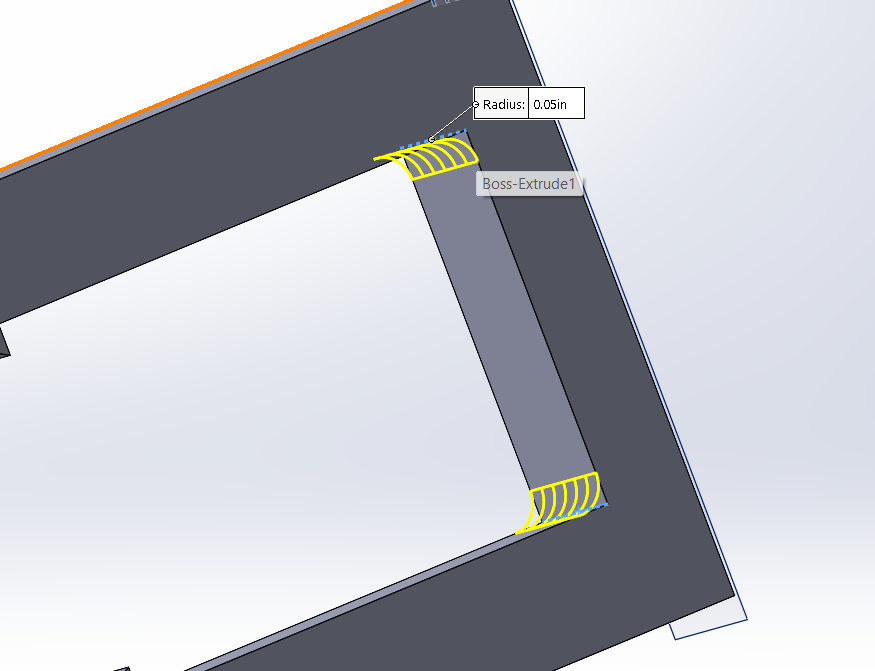  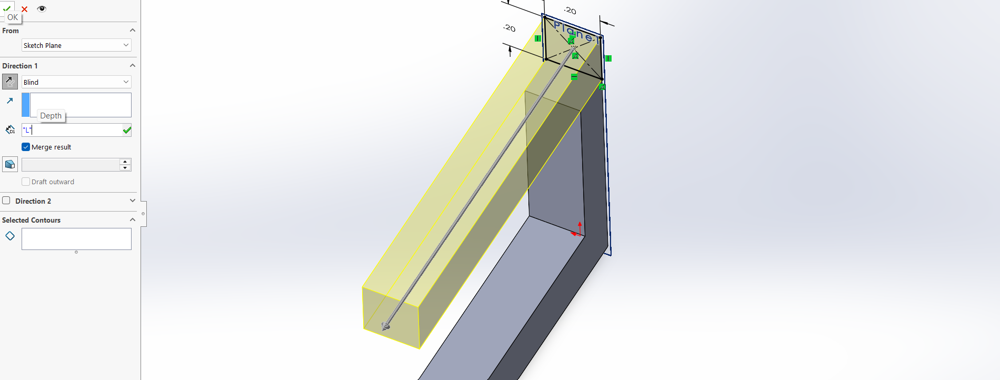  

The fillets were added to reduce stresses that would occur at the right angles.  

Designing the fitted cylinder:  

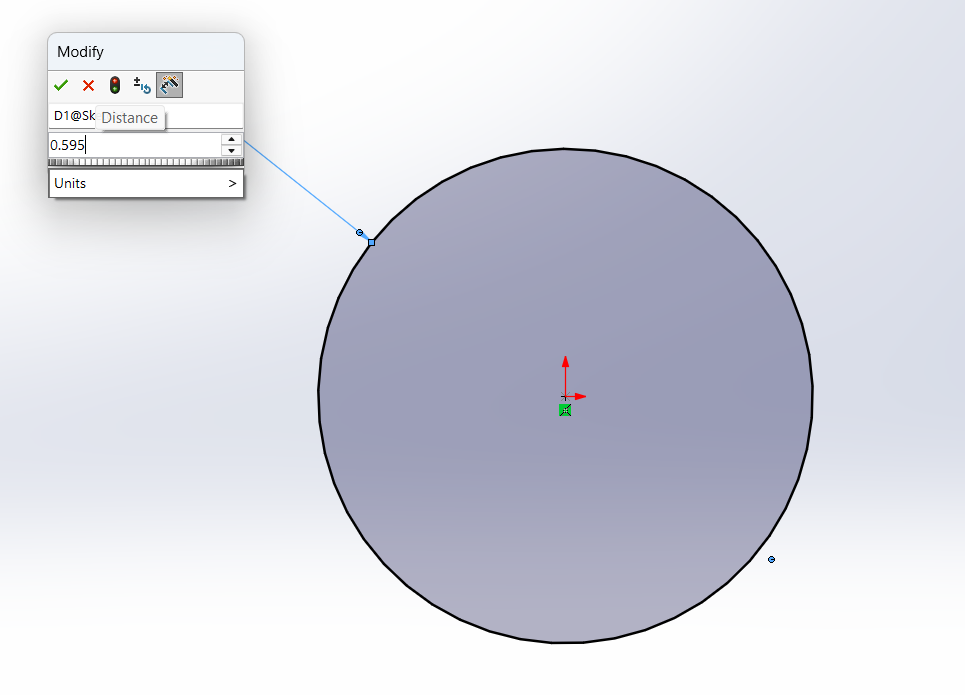 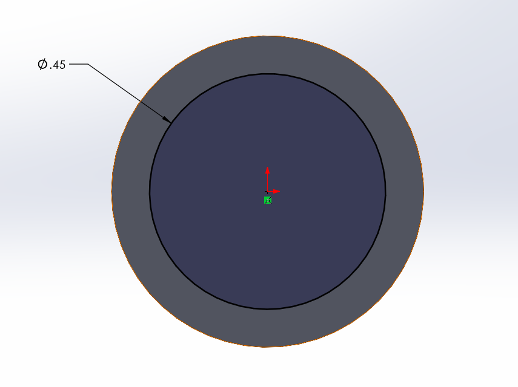 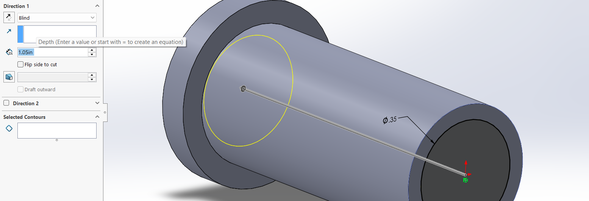 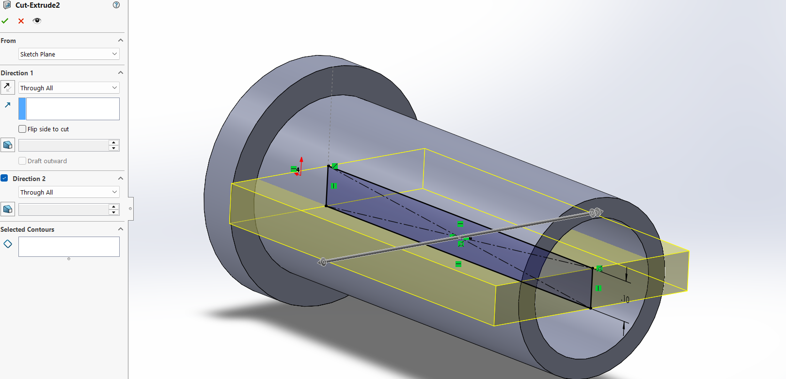 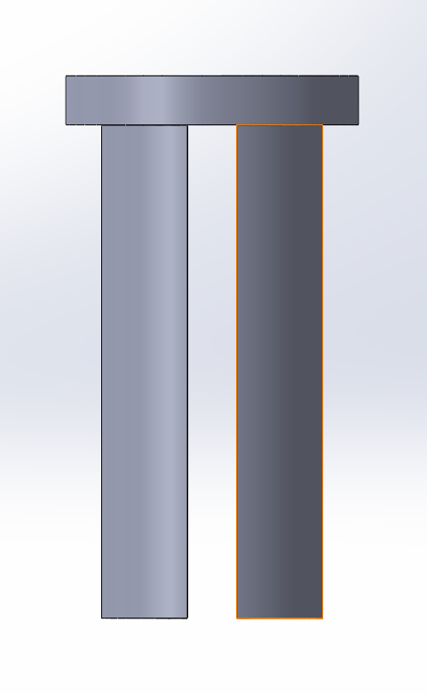  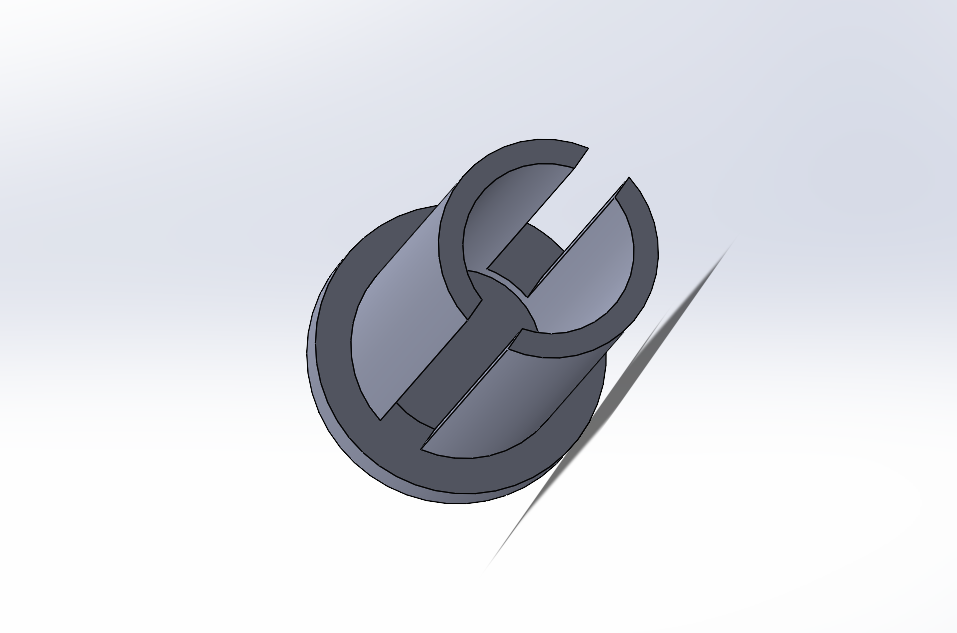 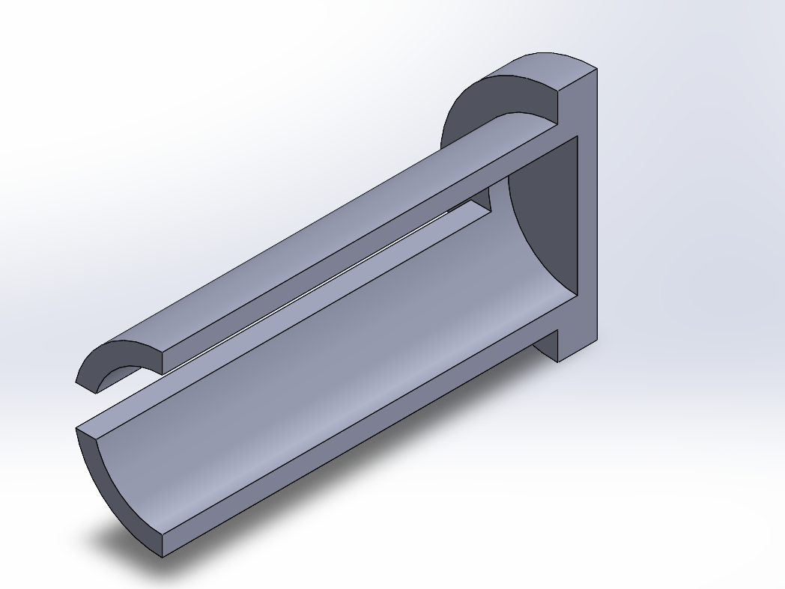  

I then made an assembly of the two parts to ensure they fit properly together.  
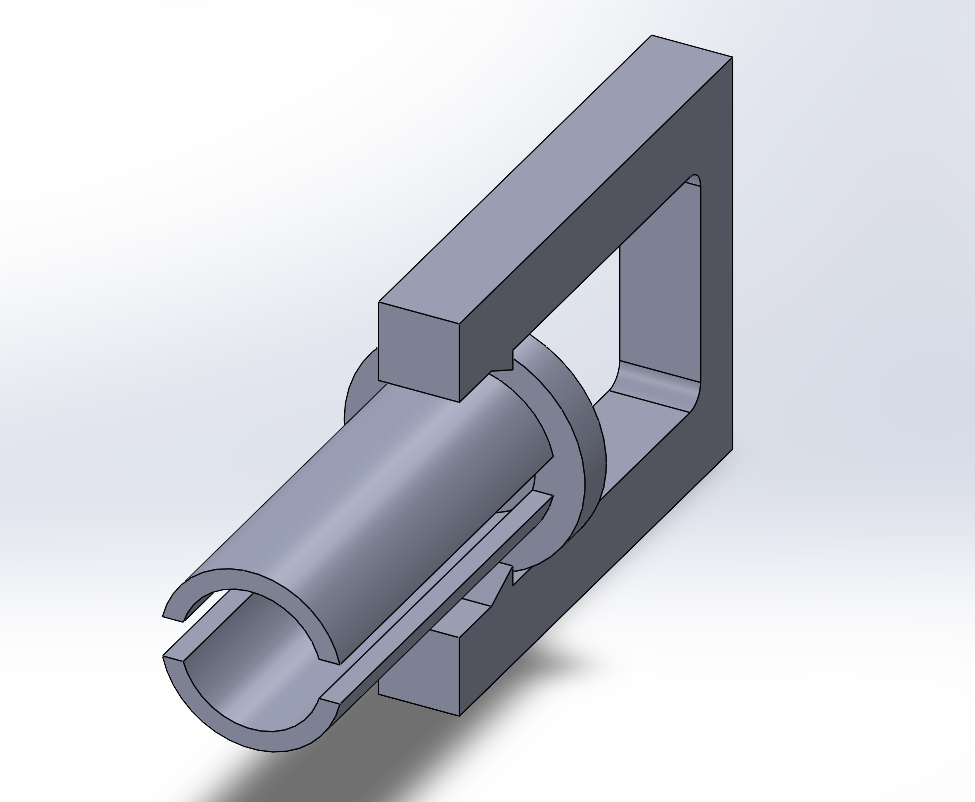  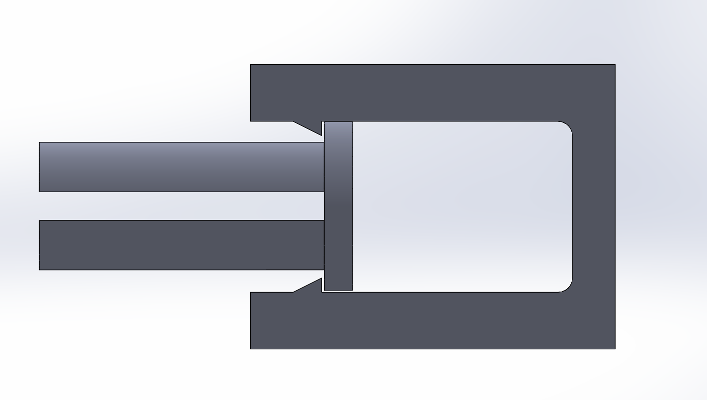  

## Research  

My build orientation was chosen to maximize the strength of the flexure part. My research concluded that to maximize strength the strength in a bending part, the filament layers should run along the length of a part. This lines up with how I oriented my bracket in PrusaSlicer, I oriented it so that the printer would build long flat layers, with the force acting on the flat surface. I drew a picture to visualize this.      

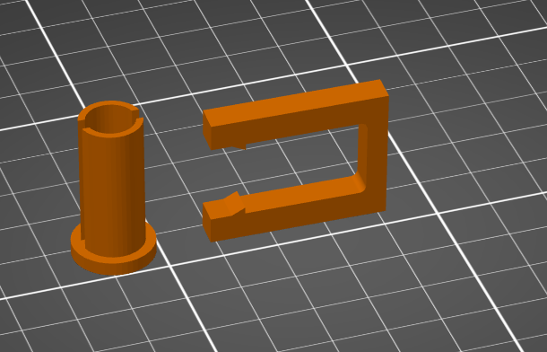  

