# A6 – Design Fits for an Artifact

## Objective
-Parametrically design something small that snap fits (fits that cannot be pulled apart easily) into one of the features of the artifact measured in class.  
-Use parameters in CAD  
-Use constraints in CAD  
-Test your design, if it does not fit properly redo.  

## Parametric Design  

The artifact I used was an Arduino board and I wanted to create a snap fit bracket that wraps around two sides of the board, could not be pulled back off and had a snug fit. Before I designed in SolidWorks I used beam bending equations to determine appropriate dimensions, so that the snap fit bending would not cause failure in the arms and would be thin enough to bend properly. I made multiple decisions for the dimensions and decided a factor of safety of 3. I solved for the minimum width of the brackets needed to withstand the deformation, which I decided based on the length of the snap fit clip.  

  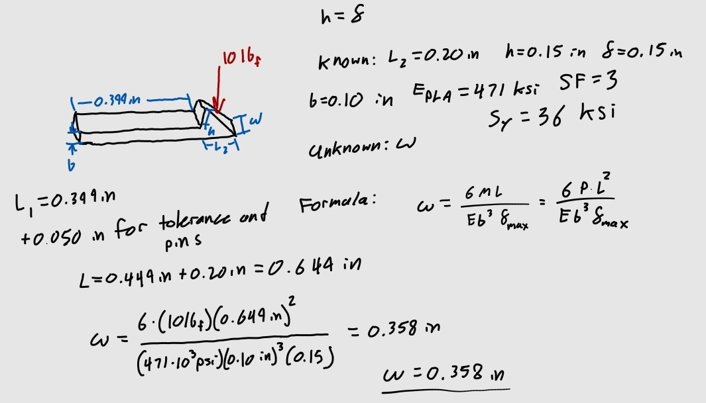   

These calculations were based on measurements I took of the arduino board. I measured the width of the board, the thickness of the board and the thickness of the board and the height of the pin holes together.  

For the width of the bracket, I wanted it to be very close to the width of the arduino board so that it would fit very snug and not slide side to side. So I designed the bracket with an extra .005in allowance. I would later realize that this was not nearly enough. 

I also added a clearance of 0.05in to the length from the base of the bracket arm and the bottom of clip piece. This was to ensure that the soldered pins at the bottom of the arduino would not interfere and to give an allowance for the fit on the pin holes.  

I designed the part in SolidWorks parametrically, this was especially important for this part because I knew I would possibly need to change my values to adjust the fit.  

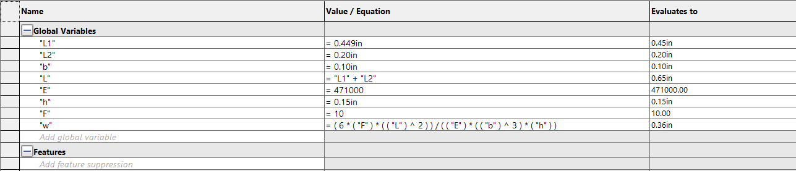  

My original modelling. I added fillets at the bending point to decrease stress concentrating there.  

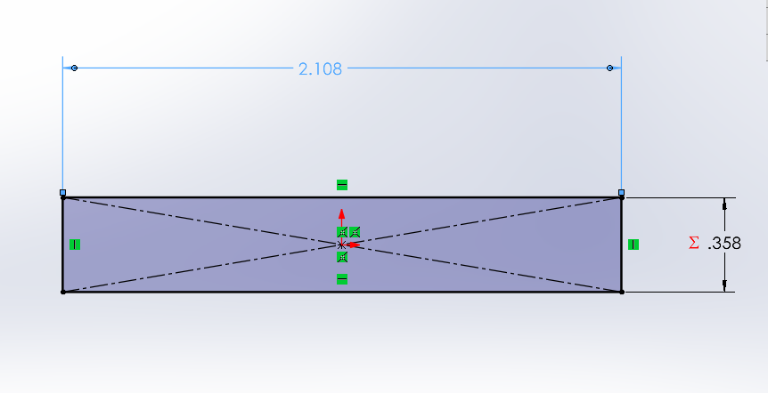 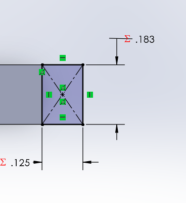 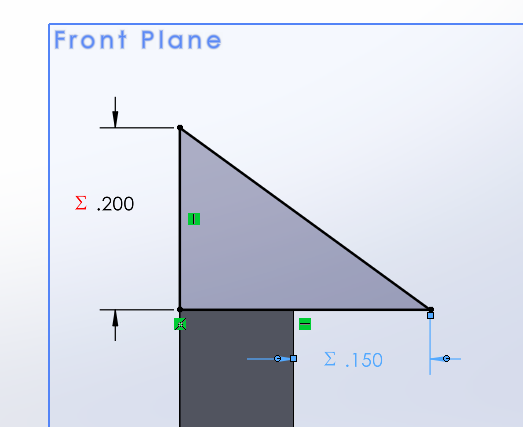 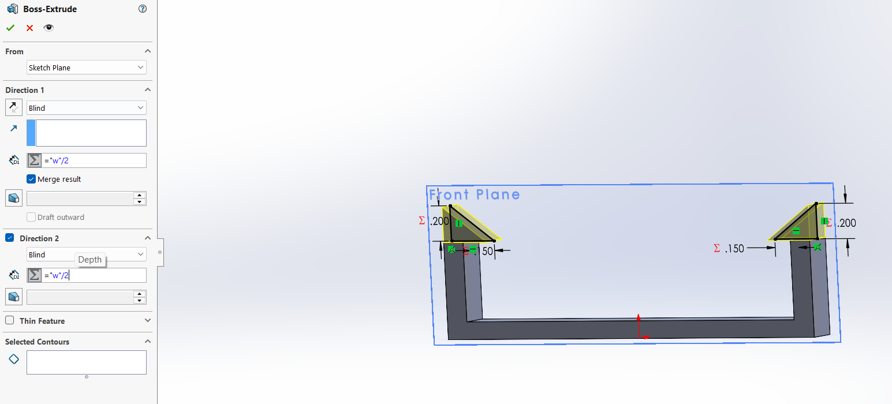 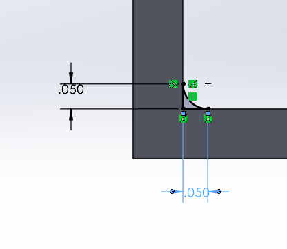 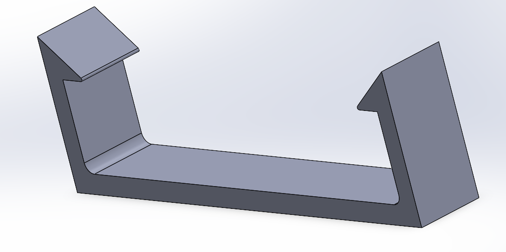  

## Print and Remodelling

In my print I decreased the perimeters because I wanted to ensure give the arms less strength to allow for sufficient bending. Although this may have been helpful for that purpose I realized it was a mistake if I had actually wanted to use this part repeatedly as the joint where the bending occurs began to break after repeated uses.  

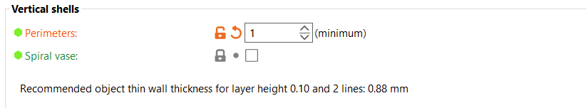  

I decreased the layer height to increase precision, although it would take more time, I wanted to ensure that the dimensions were as precise as possible.  

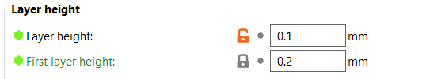 

I used the infill to compensate for any loss of strength from the perimeters by using honeycomb, which does well at distributing stress across the part. Although I kept the fill density low for time.  

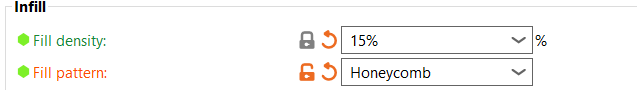  

I oriented my build to be laid on its side, which increases strength by creating the layers larger across the application of force. It would have been stronger if I oriented so that one arm was on the print bed and the other was hanging and used supports. I chose the former to save time, and it would have made the connection between the two arms weaker, which also bends and needs strength.  

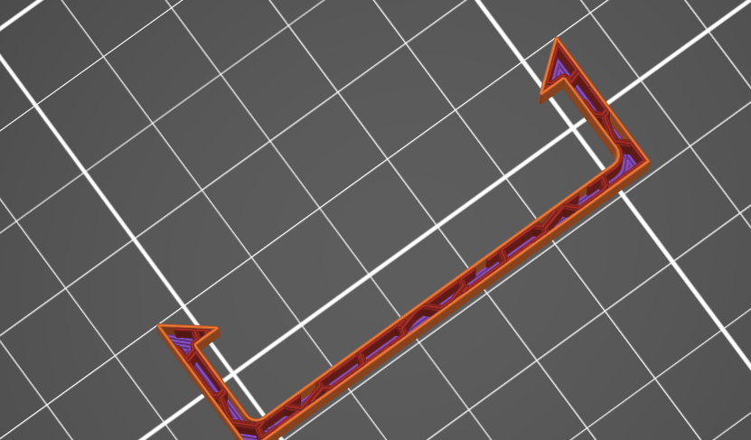  

Final print time:  

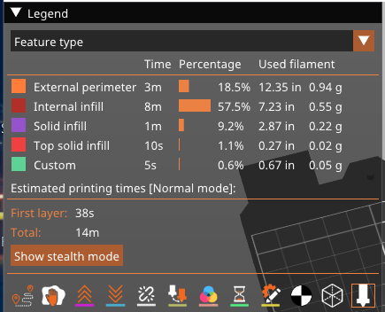  

Print volume and size:  

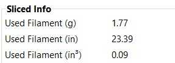 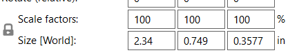  

When the print was completed I tested it and realized that I had not accounted for the amount the arms would need to bend in relation to the length of the base of the clip. Although I could slide the part onto the arduino board, it would bend enough to snap fit onto the board from the bottom. I went back into my model and gave it an extra allowance of about 0.072in and tried again.  

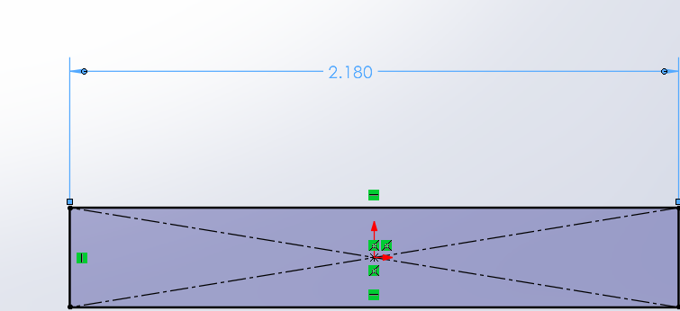  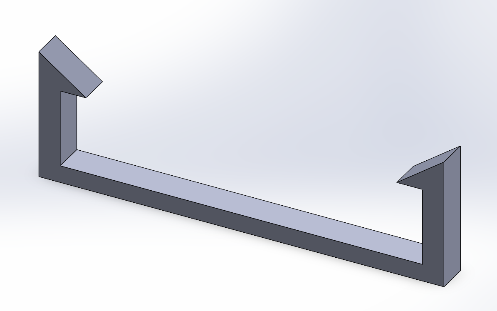  

On this try the part clipped onto the arduino easily, but it slide from side to side with too much space, which was against my design intent. So I printed a third time, and decreased the allowance by 0.04in.  

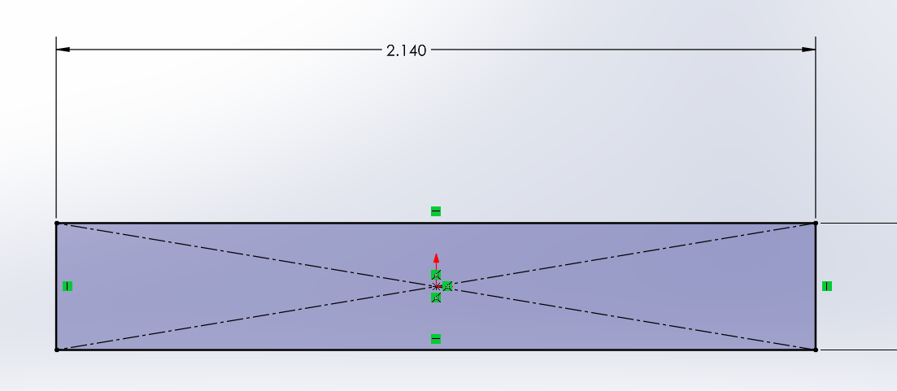  

This dimension was sufficient in snap fitting onto the board and gave it a snug fit.  

I documented the difference in these lengths with a picture, with the middle part being the final product.  

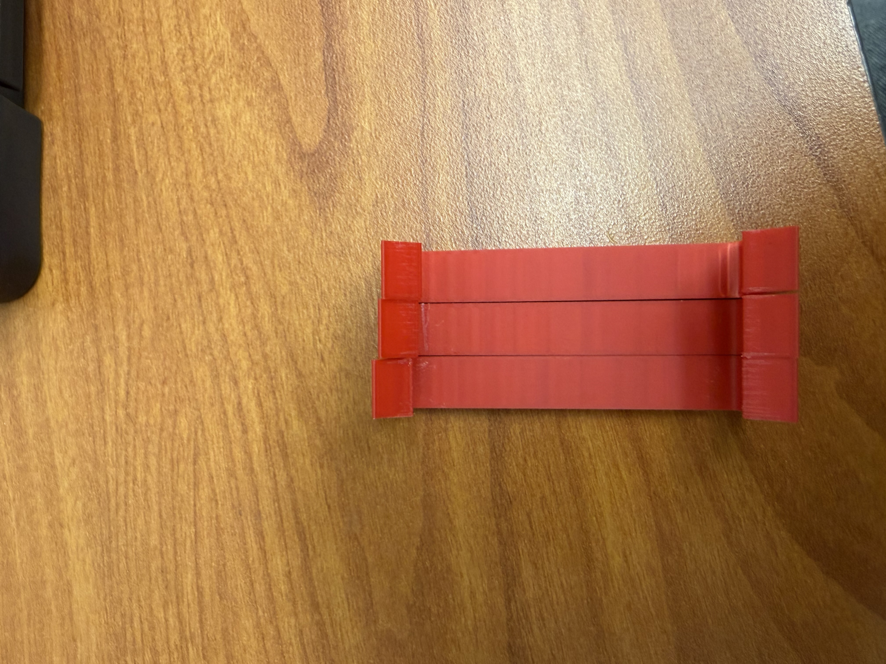   

**Video of Print:** https://drive.google.com/file/d/1jZUB90Jsis3Md0EFb-yboEAqE_ztr2J0/view?usp=sharing  

## Lessons Learned  

I learned a lot about allowances and considering all parts of a build when considering them. My initial mistake when finding the allowance for the width of the board was simply that I only considered the tolerance of the Prusa's dimensioning capabilities. I created an ideal fit in practice that didn't work when considering how the part needed to snap fit. So I found a sweet spot between fit and the arms ability to bend, I also realize I could have decreased the connecting sections width a little to account for the bending problem. Although my decisions for the allowance on the length of the arm were surprisingly accurate, considering it was an educated guess, as I did not have access to the calipers to measure the height of the soldering on the bottom of the board. Another mistake I made was with the perimeters and infill, I should have increased the perimeters to prevent the fatigue failure that occurred at the bending joint, I also do not think I needed to lower the layer height, considering the size of my build that level of precision was not necessary.  

This assignment took between 8-9 hours to complete.  

