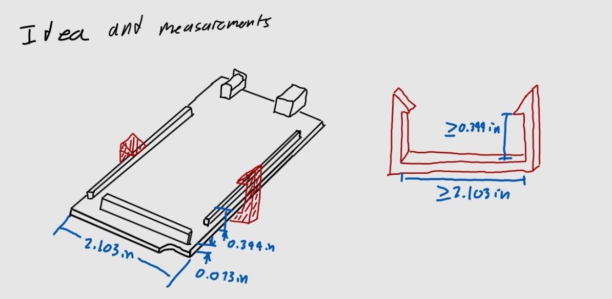
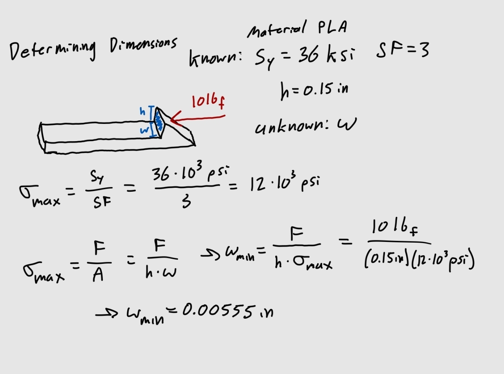
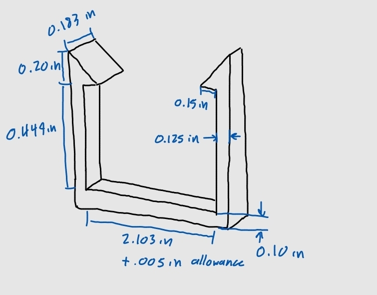

# A6 – Design Fits for an Artifact

## Objective
-Parametrically design something small that snap fits (fits that cannot be pulled apart easily) into one of the features of the artifact measured in class.  
-Use parameters in CAD  
-Use constraints in CAD  
-Test your design, if it does not fit properly redo.  

## Analyze

The artifact I used was an Arduino board and I wanted to create a snap fit bracket that wraps around two sides of the board, could not be pulled back off and had a snug fit. Before I designed in SolidWorks I used beam bending equations to determine appropriate dimensions, so that the snap fit bending would not cause failure in the arms and would be thin enough to bend properly. I made multiple decisions for the dimensions and decided a factor of safety of 3. I solved for the minimum width of the brackets needed to withstand the deformation. 

     

## Decide

## Communicate

